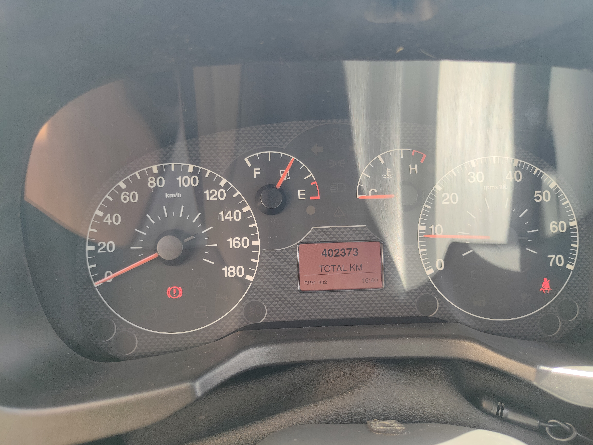
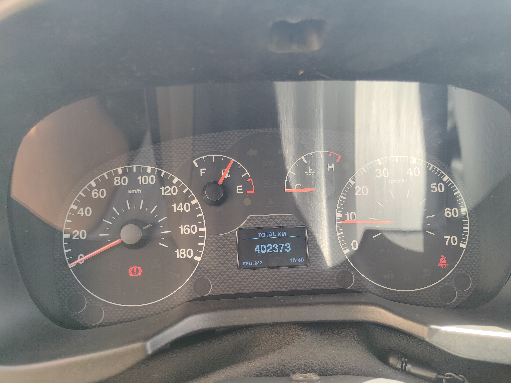
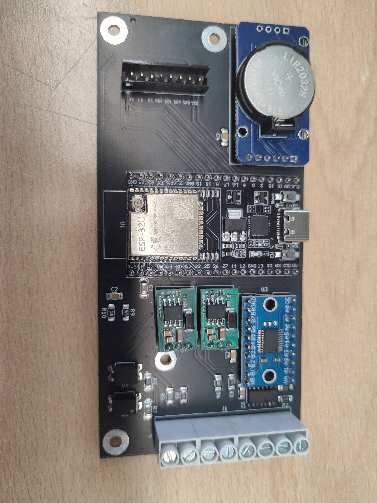

# Fiat Fiorino TFT Display Upgrade (400k km Odometer Fix)

<div align="center">
  
  
  
  
</div>

<p align="center">
  <b>🇬🇧 English</b> | 🇪🇸 <a href="README.es.md">Español</a>
</p>

---

## The Challenge & Official Roadworthiness Success (ITV)

Many instrument clusters on Fiat Mini platform vehicles (Fiorino, Grande Punto, Alfa Romeo Mito) have a factory software bug: once the odometer reaches **399,999 km**, it permanently freezes and stops recording mileage. In countries with strict mandatory vehicle inspections (like the Spanish **ITV**), this effectively renders a mechanically sound vehicle illegal to drive.

Rather than replacing the entire cluster with expensive parts that will eventually fail again, this project replaces the stock central monochrome LCD with a custom **2.4" ST7789 color TFT display** driven by an ESP32. 

By reverse-engineering the vehicle's B-CAN bus, the microcontroller reads live telemetry, **independently calculates and securely stores the total mileage**, and renders a custom UI.

**The vehicle successfully passed the official Spanish ITV inspection with this system installed, proving the reliability and accuracy of the embedded solution.**


## User Interface: Dual Theme Integration

The system features on-the-fly theme switching to match the driver's preference.

<div align="center">
  <figure style="display: inline-block; width: 45%;">
    <figcaption><b>Classic Amber (OEM Fiat Match)</b></figcaption>
    
  </figure>
  <figure style="display: inline-block; width: 45%;">
    <figcaption><b>Modern Dark Theme</b></figcaption>
    
  </figure>
</div>


## Prototype vs. Final Hardware

<div align="center">
  <figure style="display: inline-block; width: 45%;">
    <figcaption><b>Phase 1: Breadboard & Spaghetti Wiring</b></figcaption>
    
  </figure>
  <figure style="display: inline-block; width: 45%;">
    <figcaption><b>Phase 2: Custom Carrier Board</b></figcaption>
    
  </figure>
</div>


## Hardware Design

> **[Deep Dive: View the full Custom PCB details, SMT BOM, and Schematics in the Hardware Documentation ➔](hardware/README.md)**

The custom board interfaces directly with the cluster's internal electronics:

* **MCU:** ESP32 DevKit (handles dual-core RTOS logic, display DMA, and deep sleep state).
* **CAN Interface:** **TJA1055T** (Fault-Tolerant Low-Speed B-CAN transceiver) paired with a **TXS0108E** bi-directional logic level shifter (3.3V <-> 5V).
* **Display:** 2.4" SPI TFT (ST7789) driven using **LovyanGFX** with hardware DMA.
* **RTC & External Storage:** **DS3231 RTC + AT24C32 EEPROM** over I2C. Keeps track of real-time clock data and stores extra mileage past 399,999 km without wearing out the ESP32's flash memory.
* **Dual Power Regulation:**
  * **Buck 1 (Always-On 12V / Battery Line 30):** Keeps the ESP32 powered briefly after ignition off to execute EEPROM saves and transition into Deep Sleep (~10–20 µA consumption).
  * **Buck 2 (Switched 12V / Ignition Line 15):** Powers the CAN transceivers and level shifters only when the ignition key is turned on.
* **Ignition Sensor:** GPIO 34 monitors key status using an RC filter divider (33kΩ / 10kΩ + 100nF) to trigger a hardware ISR (`FALLING`).
* **Cluster Buttons:** Hybrid input architecture using discrete GPIO inputs for `TRIP` and `MINUS` controls, plus a multiplexed ADC1 channel (`ADC_CHANNEL_MENU_PLUS`) to decode `MENU` and `PLUS` buttons from a single resistor ladder line.


## Key UI & Display Features

* **Dual Visual Themes:** Switch between **Classic Amber** (faithful OEM Fiat monochrome look) and **Modern UI** (dark background with custom theme accents).
* **Dynamic Shift/RPM Indicator:** Features a multi-stage RPM bar in the modern theme. Reaching critical engine speeds triggers a flashing alert directly on the bar.
* **On-the-Fly Unit Conversion:** Seamless switching between Metric (`km`, `L/100km`, `°C`) and Imperial (`mi`, `mpg`, `°F`) unit systems.
* **Integrated Clock & Settings Menu:** Full multi-level settings menu to configure time via DS3231 RTC, trip computer reset, language preferences, and dynamic colors directly using original dashboard buttons.
* **Hardware Status Overlays:** On-screen popups notify the user of real-time EEPROM state, successful saves during key-off, or memory corruption errors.


## Firmware Architecture (FreeRTOS)

> **[Deep Dive: View the complete reverse-engineered Fiat B-CAN frame matrix here ➔](docs/CAN_Matrix.md)**

The software is written in C++ using FreeRTOS, splitting telemetry decoding and UI rendering across both ESP32 cores:

* **Core 0 (`task_can_core0`):** High-priority execution. Decodes real-time B-CAN frames (speed, RPM, fuel level, autonomy) and calculates high-frequency trip computer metrics.
* **Core 1 (`task_gui_core1`):** Renders the ST7789 UI via SPI DMA capped at ~25 FPS (40ms period) for continuous display updates without starving system resources. Handles button polling via ADC1, manages finite state machine (FSM) screen changes, updates the real-time clock overlay, and orchestrates the safe shutdown sequence.
* **Thread Safety:** Telemetry data calculated on Core 0 is exposed to Core 1 via a thread-safe `SharedData` struct protected by a FreeRTOS `dataMutex`.
* **Power-Down Sequence:** When the ignition key is turned off, GPIO 34 fires a hardware ISR (`FALLING`). Core 1 verifies a stable 2-second power loss, saves odometer data to the external AT24C32 EEPROM over I2C, displays a visual saving feedback overlay, and puts the ESP32 into Deep Sleep.
* **Passive CAN ASCII Streamer:** Toggling `#define ENABLE_USB_SNIFFER 1` outputs raw B-CAN frames over Serial using standard LAWICEL/SLCAN formatting (`t1238...`). This allows live traffic monitoring and logging via any Serial terminal or custom Python scripts.
* **Advanced Button Handling & Combos:** Non-blocking debouncing with support for multi-button combinations (e.g., `TRIP` + `PLUS`). `TRIP` actions trigger on release to serve as a modifier key, while transient ADC lockout logic prevents false triggers during analog voltage transitions.


## Getting Started & Building

This project is built using [ESP-IDF](https://docs.espressif.com/projects/esp-idf/en/latest/esp32/). Because this repository depends on external libraries linked as Git submodules, you must clone it recursively.

**1. Clone the repository:**
```bash
git clone --recursive https://github.com/raul-pineiro/Fiat-Fiorino-CAN-Dashboard.git

```

*(If you already cloned it without the `--recursive` flag, run `git submodule update --init --recursive` inside the folder).*

**2. Build & Flash:**

* Open the project in your IDE.
* Select the **ESP32 Dev Module** as the target board.
* Compile and upload via USB.


## Customizing Fonts (Advanced)

This repository includes a pre-compiled `MyFonts.h` file so you can build the ESP32 firmware out-of-the-box. However, if you want to change the UI typography, you can generate a custom header using the Python script located in the `tools/` directory.

Due to copyright and licensing restrictions, raw `.ttf` and `.otf` font files are not included in this repository. You will need to download your own fonts (e.g., from Google Fonts) to use this tool.

**How to generate a custom font header:**

1. **Install dependencies:** The script requires the Freetype library.
   ```bash
   pip install freetype-py
   ```

2. **Run the generator:** Pass the output filename, followed by groups of three arguments for each font (file path, size in pt, and the C++ struct name).
   ```bash
   python tools/ttf2gfx.py MyFonts.h my_custom_font.ttf 16 CustomFontName 
   ```


3. **Replace the original:** Move your newly generated `MyFonts.h` into the firmware's include directory, overwriting the default one.

> **⚠️ Important Code Modification Required:**
> The names you assign in the Python command (like `CustomFontName`) become the actual C++ struct names in the header file. If you generate a header with new or different font names, you **must** manually update `ScreenHandler.cpp` to reference these new names. If the display logic looks for the old font structs, the firmware will fail to compile.


## Third-Party Libraries & Credits

* **[LovyanGFX](https://github.com/lovyan03/LovyanGFX)** by `@lovyan03` – Fast, memory-efficient display driver library for ESP32 (linked as Git submodule).


## License

MIT License. See `LICENSE` for details.