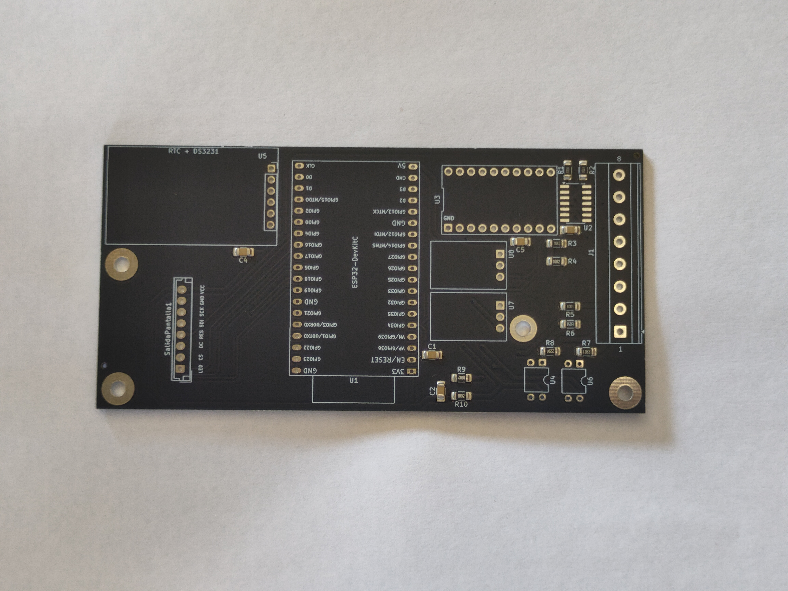
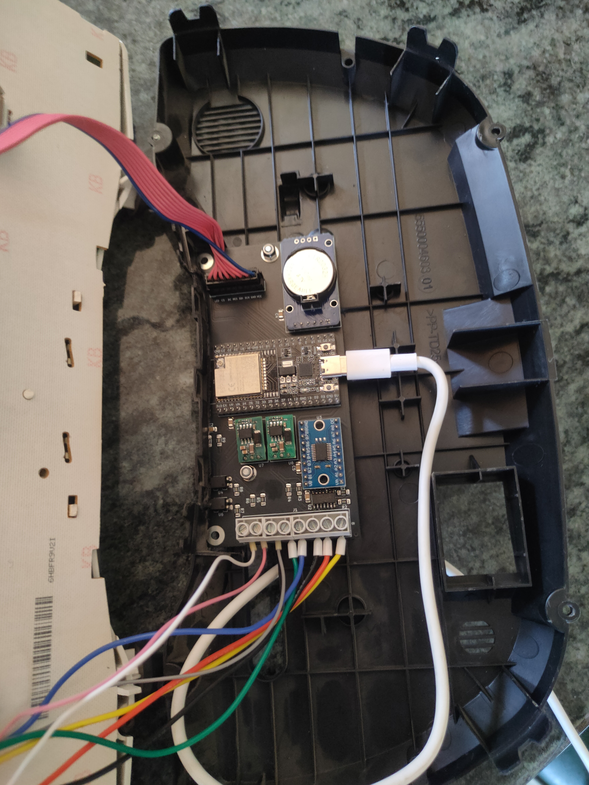
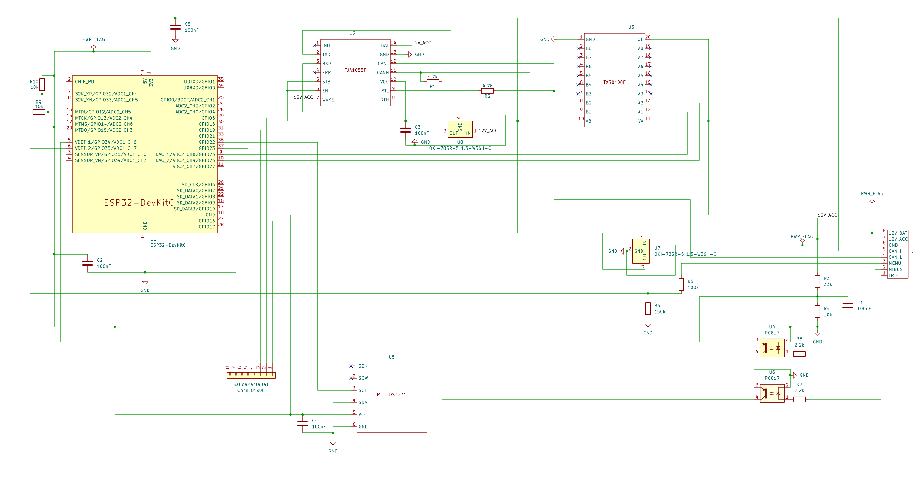

# Especificaciones de Hardware y Lista de Materiales (BOM)

  🇬🇧 <a href="README.md">English</a> | <b>🇪🇸 Español</b>

Este documento especifica la selección de componentes electrónicos, la arquitectura del sistema y la integración de módulos para la placa de interfaz del Clúster Digital B-CAN de Fiat Mini.

El diseño utiliza una **Arquitectura de Placa PCB**, combinando el ensamblaje automatizado de componentes pasivos SMT con módulos funcionales comerciales y etapas de desacoplamiento óptico para un prototipado rápido y facilidad de mantenimiento modular.

## 1. Lista de Materiales (BOM) para Ensamblaje de Montaje Superficial (JLCPCB PCBA)

| Ref / Designador | Cant. | Valor / Descripción | Huella (Footprint) | Fabricante | MPN | Ref. LCSC | Función / Ruta de Señal |
| --- | --- | --- | --- | --- | --- | --- | --- |
| **C1, C2, C3, C4, C5** | 5 | 100 nF, 50V, X7R Cerámico | 1206 | Samsung | `CL31B104KBCNNNC` | C24497 | Desacoplo y Filtro Antirrebote RC |
| **R1, R2** | 2 | 4.7 kΩ, 1%, 0.25W | 1206 | UNI-ROYAL | `1206W4F4701T5E` | C17936 | Polarización del Bus CAN TJA1055 (RTH/RTL) |
| **R3** | 1 | 33 kΩ, 1%, 0.25W | 1206 | UNI-ROYAL | `1206W4F3302T5E` | C18004 | Divisor de Tensión de Encendido (Superior) |
| **R4, R9, R10** | 3 | 10 kΩ, 1%, 0.25W | 1206 | UNI-ROYAL | `1206W4F1002T5E` | C17902 | Divisor de Tensión de Encendido (Inferior) y Resistencias Pull-down |
| **R5** | 1 | 100 kΩ, 1%, 0.25W | 1206 | UNI-ROYAL | `1206W4F1003T5E` | C17900 | Divisor de Protección del ADC Cable 1 (Superior) |
| **R6** | 1 | 150 kΩ, 1%, 0.25W | 1206 | UNI-ROYAL | `QR1206F150KP05Z` | C176234 | Divisor de Protección del ADC Cable 1 (Inferior) |
| **R7, R8** | 2 | 2.2 kΩ, 1%, 0.25W | 1206 | UNI-ROYAL | `1206W4F2201T5E` | C17948 | Limitación de Corriente del Optoacoplador / Resistencias Pull-up |

> **Referencia Cruzada:** 
> La selección de valores de alta impedancia para la matriz analógica de botones (R5, R6) es crítica para evitar códigos de error en la centralita (BCM). La justificación matemática y el mapeo de señales se detallan en el documento [Análisis de Pinout OEM e Ingeniería Inversa](OEM_Pinout_Analysis.es.md).

---

## 2. Circuitos Integrados, Potencia y Subensamblajes Comerciales

| Ref / Designador | Cant. | Componente / Módulo | Fabricante / Origen | MPN / Estándar | Interfaz / Encapsulado | Especificaciones Técnicas y Función |
| --- | --- | --- | --- | --- | --- | --- |
| **U1** | 1 | Núcleo del Microcontrolador | Espressif Systems | `ESP32-WROOM-32` | Placa DevKit (Cabezal DIP) | Doble Núcleo a 240 MHz, Lógica de 3.3V, Wi-Fi/BT |
| **U2** | 1 | CI CAN Tolerante a Fallos | NXP Semiconductors | `TJA1055T/3/C,518` | SOIC-14 (Soldadura Directa) | B-CAN de Baja Velocidad (50 kbps), Grado Automotriz |
| **U3** | 1 | Subplaca Traductora de Nivel | COTS (AliExpress) | Placa Breakout `TXS0108E` | Módulo con Cabezal de Pines | Traductor de Nivel de Tensión Bidireccional de 8 Canales (3.3V ↔ 5V) |
| **U4, U6** | 2 | Aislador Optoacoplador | Sharp / Genérico | `PC817` | DIP-4 / Módulo | Desacoplamiento Óptico de Señal para los Botones "Menos" (U4) y "Trip" (U6) |
| **U5** | 1 | Subplaca RTC y EEPROM | COTS (AliExpress) | `DS3231` + `AT24C32` | Cabezal de Pines I2C (LIR3032) | RTC TCXO de Alta Precisión + Memoria No Volátil (Respaldo por Batería) |
| **U7** | 1 | Convertidor Reductor DC-DC | Murata Power Solutions | `OKI-78SR-5/1.5-W36-C` | En Línea Simple (SIP-3) | Entrada Permanente de Batería de 12V → Salida de 5V (Modo Suspensión / Deep Sleep) |
| **U8** | 1 | Convertidor Reductor DC-DC | Murata Power Solutions | `OKI-78SR-5/1.5-W36-C` | En Línea Simple (SIP-3) | Entrada Conmutada por Encendido de 12V → Salida de 5V (Lógica/CAN) |
| **SalidaPantalla1** | 1 | Subensamblaje de Pantalla | Sitronix / COTS | Controlador `ST7789V` | Panel TFT de 2.4" (SPI) | Resolución de 240 × 320, Interfaz SPI de 4 Hilos |

---

## 3. Arquitectura Eléctrica y Aspectos Destacados de Seguridad

1. **Etapa de Aislamiento Galvánico (Optoacopladores `PC817`):**
* Los transitorios automotrices de alto voltaje (picos de carga, retroceso inductivo de relés) y picos de tensión en las líneas de entrada se desacoplan de los sensibles GPIOs del ESP32 mediante acondicionamiento óptico de señal.

2. **Regulación de Potencia de Alta Eficiencia (`OKI-78SR`):**
* Los reguladores conmutados `OKI-78SR` de Murata reemplazan a los reguladores lineales 7805 para eliminar los problemas de disipación de calor bajo un rango de entrada de 7V a 36V, logrando más de un 85% de eficiencia y evitando el apagado térmico en los entornos del habitáculo del vehículo.

3. **Capa CAN Tolerante a Fallos (`TJA1055T`):**
* Seleccionada por su compatibilidad física con el B-CAN de Fiat (50 kbps). Maneja modos de fallo de un solo hilo y reconfigura automáticamente la topología del bus ante fallos físicos en CANH o CANL.

4. **Interconexión de Pantalla (`SalidaPantalla1`):**
* La conexión del panel se enruta a través de un conector JST dedicado (`SalidaPantalla1`) en la Placa PCB, desacoplando el montaje mecánico de la pantalla de la placa de circuito impreso (PCB) principal.

## 4. Ensamblaje Mecánico e Integración de Módulos

Para garantizar un prototipo fiable sin cables sueltos, el sistema utiliza un enfoque de montaje rígido:

* **Montaje de la placa:** La placa portadora personalizada se fija directamente a la carcasa trasera de plástico del cuadro original (OEM) utilizando separadores hexagonales estándar.

* **Integración de módulos:** Todos los submódulos comerciales (ESP32, transceptor CAN, adaptadores de nivel) están anclados físicamente a la placa portadora mediante conectores de pines *through-hole* y soldados en su lugar, proporcionando conexiones eléctricas y mecánicas estables.

* **Modificación de la carcasa:** El soporte original de plástico ABS se modificó utilizando herramientas rotativas para acomodar el chasis de la nueva pantalla TFT de 2.4", asegurando un ajuste perfecto y al ras.

  
  
  

  <i>Izquierda: Ensamblaje SMT. Centro: Montaje con separadores hexagonales. Derecha: Adaptación del soporte OEM para la pantalla TFT.</i>

## 5. Esquema Eléctrico

Toda la lógica del circuito, incluyendo el enrutamiento de señales, los divisores de tensión y las etapas de aislamiento óptico, está completamente documentada en el esquema a continuación.

  

  <i>Haz clic en la imagen para ver o descargar el archivo <a href="schematic.pdf">schematic.pdf</a> en alta resolución.</i>

> **Nota:** Aunque se proporciona la arquitectura eléctrica completa para mayor transparencia y revisión por pares, los archivos de fabricación en bruto (Gerbers) se han excluido de este repositorio.